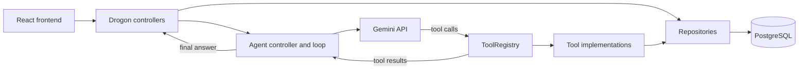
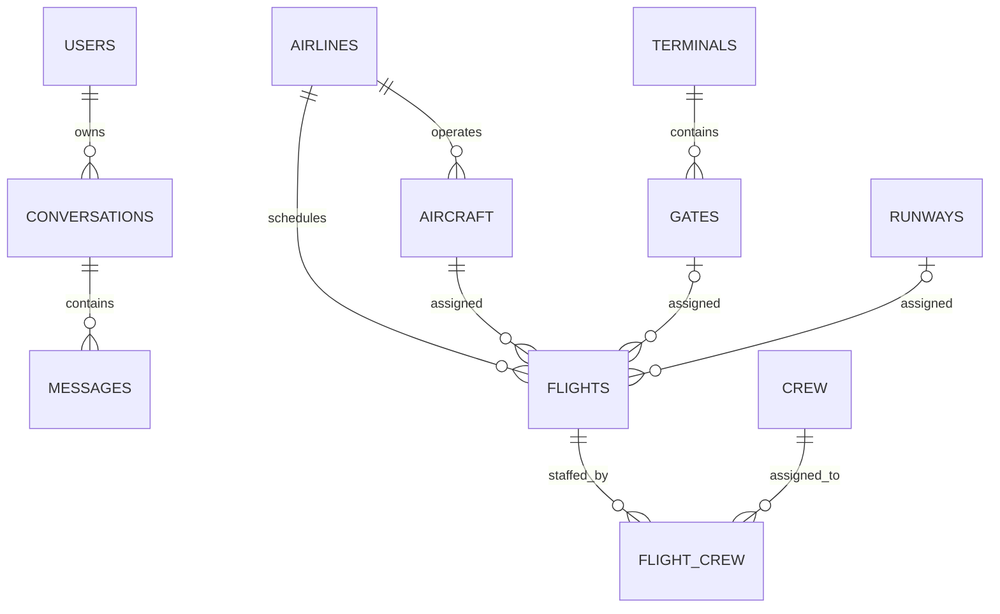

# AeroMind

## Project overview

AeroMind is a university project demonstrating how an authenticated AI agent can help airport operations staff explore flights, gates, runways, incidents, and weather through a conversational interface. The backend combines a REST API with Gemini function calling, a bounded agent loop, nine safe tools, and persistent user-owned conversation history.

The repository uses realistic simulated airport data. It is suitable for coursework and demonstrations, but is not connected to live airport systems and must not be used for safety-critical decisions.

## Key features

- Airport operations REST API
- Registration, bcrypt password hashing, and expiring JWT authentication
- JWT-protected writes and conversation routes
- Gemini through Google's OpenAI-compatible endpoint
- Nine registered tools and multi-step agent execution
- Persistent conversation history with ownership enforcement
- Flight, gate, runway, incident, and weather workflows
- React overview and chat interface
- Backend and frontend automated tests
- Docker Compose environment with PostgreSQL health checks

## Technology stack

| Area | Technology |
| --- | --- |
| Backend | C++20, Drogon, JsonCpp |
| Frontend | React 18, JavaScript, React Router, Axios, Vite |
| Database | PostgreSQL 16, libpqxx |
| AI provider | Google Gemini REST API, OpenAI-compatible format |
| Authentication | bcrypt via `crypt`, HS256 JWT via jwt-cpp |
| Build | CMake, npm |
| Containers | Docker, Docker Compose |
| Testing | GoogleTest/CTest, Vitest, Testing Library |

## System architecture



The frontend never contacts Gemini directly. Provider credentials, tool execution, ownership, and persistence remain in the backend.

## Agentic workflow

1. The user submits an authenticated query.
2. The backend extracts the verified user identity.
3. A conversation is created or ownership of the supplied conversation is checked.
4. Previous user and assistant messages are loaded from PostgreSQL.
5. Gemini receives the messages and ToolRegistry schemas.
6. Gemini requests one or several registered tools.
7. Results return with the original tool-call IDs.
8. The loop repeats up to the configured maximum.
9. The final answer and `tools_used` are returned.
10. Visible user and assistant messages are persisted.

## Implemented tools

| Tool | Type | Purpose | Main arguments |
| --- | --- | --- | --- |
| `find_delayed_flights` | Read | List delayed flights | None |
| `get_active_incidents` | Read | List open or investigating incidents | None |
| `get_all_incidents` | Read | List active and resolved incidents | None |
| `get_incidents_by_severity` | Read | Filter incidents by severity | `severity` |
| `search_incidents` | Read | Search incident title, description, and location | `query` |
| `get_all_flights` | Read | List all flights | None |
| `get_flight_details` | Read | Get one flight | `id` |
| `get_flight_by_id` | Read | Get one flight by internal ID | `flight_id` |
| `get_flight_by_number` | Read | Get one flight by public number | `flight_number` |
| `search_flights` | Read | Search with combined optional filters | optional filters |
| `update_flight_status` | Write | Update a validated flight status | `flight_id`, `status` |
| `assign_flight_to_gate` | Write | Transactionally assign a gate | flight and gate identifiers |
| `get_available_gates` | Read | List available gates | None |
| `get_all_gates` | Read | List every gate | None |
| `get_gate_by_id` | Read | Look up a gate by internal ID | `gate_id` |
| `get_gate_by_number` | Read | Look up a public gate number | `gate_number` |
| `get_terminal_status` | Read | Summarize terminal gate and flight status | `terminal_id` |
| `get_flights_by_terminal` | Read | List flights assigned to terminal gates | `terminal_id` |
| `get_runway_status` | Read | List runways and statuses | None |
| `get_runway_by_id` | Read | Look up a runway by internal ID | `runway_id` |
| `get_runway_by_code` | Read | Look up a runway by public code | `runway_code` |
| `update_runway_status` | Write | Update runway status and report affected flights | `status` and runway identifier |
| `get_latest_weather` | Read | Get the newest weather report | None |
| `resolve_incident` | Write | Resolve an incident | `id` |
| `create_incident` | Write | Create an incident | `title`, `description`, `severity`; optional `location` |

The canonical registry contains 24 operational tools. The deprecated `get_flight_details` alias is retained for compatibility. Registry metadata is the source for both Gemini declarations and execution; all writes require verified user context and all handlers reuse REST domain services.

### Multi-tool scenario

The tested agent loop supports: “Give me a full operations status: what flights are delayed, what incidents are active, and what is the current weather?” Gemini can call `find_delayed_flights`, `get_active_incidents`, and `get_latest_weather`, then combine their results. Exact content depends on the seeded database and configured model.

## API overview

| Method | Route | Auth | Purpose |
| --- | --- | --- | --- |
| GET | `/health` | No | Service and database health |
| POST | `/auth/register` | No | Register a user |
| POST | `/auth/login` | No | Obtain a JWT |
| GET | `/auth/me` | JWT | Verify the current session |
| GET | `/flights` | No | List flights |
| GET | `/flights/delayed` | No | List delayed flights |
| GET | `/flights/{id}` | No | Get one flight |
| GET | `/gates` | No | List gates |
| GET | `/runways` | No | List runways |
| GET | `/incidents` | No | List incidents |
| POST | `/incidents` | JWT | Create an incident |
| PATCH | `/incidents/{id}/resolve` | JWT | Resolve an incident |
| GET | `/weather` | No | List recent weather reports |
| POST | `/weather` | JWT | Create a weather report |
| POST | `/agent/query` | JWT | Query or continue the agent |
| GET | `/agent/history` | JWT | List owned conversations |
| GET | `/agent/conversations/{id}/messages` | JWT | Read an owned conversation |

See [docs/API.md](docs/API.md) for full request, validation, response, and failure details.

## Database overview

Core tables are `users`, `airlines`, `aircraft`, `terminals`, `gates`, `runways`, `flights`, `crew`, `flight_crew`, `weather_reports`, `incidents`, `conversations`, and `messages`.



Weather and incidents are airport-level records without foreign keys. See [docs/DATABASE.md](docs/DATABASE.md) for all columns, constraints, indexes, and seed rules.

## Project structure

```text
backend/
  agent/          Gemini client, configuration, loop, and ToolRegistry
  controllers/    HTTP route handlers
  database/       PostgreSQL connection pool
  repositories/   Parameterized database access
  security/       bcrypt, JWT, and authentication filter
  tools/          Registered tool implementations
  tests/          C++ unit tests and fakes
frontend/
  src/components/ Reusable UI and chat components
  src/pages/      Login, registration, overview, and chat pages
  src/services/   Axios API and authentication clients
sql/              Schema and simulated demonstration seed data
docs/             API, architecture, database, testing, deployment, AI docs
scripts/          Opt-in live Gemini smoke test
```

## Requirements

The recommended path needs Docker Engine and Docker Compose. Local development additionally needs a C++20 compiler, CMake 3.16+, PostgreSQL development headers, Git, Node.js, and npm. Live agent queries require a Google AI Studio API key and access to the configured model.

## Environment configuration

```bash
cp .env.example .env
```

The template defines PostgreSQL credentials, backend database connection fields, `PORT`, `DB_POOL_SIZE`, `AI_PROVIDER`, `GEMINI_API_KEY`, `GEMINI_MODEL`, `GEMINI_BASE_URL`, and `JWT_SECRET`. Replace placeholder secrets. Inside Compose, `DB_HOST` is set to `postgres`. `.env` is ignored by Git and the Docker build context.

```dotenv
AI_PROVIDER=gemini
GEMINI_API_KEY=replace_with_your_google_ai_studio_key
GEMINI_MODEL=gemini-2.5-flash
GEMINI_BASE_URL=https://generativelanguage.googleapis.com/v1beta/openai/chat/completions
JWT_SECRET=replace_with_a_long_random_secret_at_least_32_chars
```

Model availability and quota depend on the Google project associated with the key.

## Running with Docker

```bash
docker compose build
docker compose up -d
docker compose ps
docker compose logs -f backend
```

The backend listens at `http://localhost:8848`; PostgreSQL uses port `5432`.

## Running the frontend

```bash
cd frontend
npm ci
npm run dev -- --host 0.0.0.0
```

Open `http://localhost:5173`. Vite proxies `/api` requests to the backend.

## Testing

```bash
cmake -S . -B build -DAEROMIND_BUILD_TESTS=ON
cmake --build build
ctest --test-dir build --output-on-failure

cd frontend
npm ci
npm run lint
npm run test:run
npm run build
```

Automated tests use fakes and never contact Google. The live smoke test is opt-in and also requires an AeroMind JWT:

```bash
AEROMIND_TEST_LIVE_AI=1 AEROMIND_LIVE_TOKEN='<token>' ./scripts/live_ai_smoke.sh
```

## Example requests

```bash
curl http://localhost:8848/health

curl -X POST http://localhost:8848/auth/register \
  -H 'Content-Type: application/json' \
  -d '{"username":"operator","email":"operator@example.com","password":"change-me"}'

curl -X POST http://localhost:8848/auth/login \
  -H 'Content-Type: application/json' \
  -d '{"email":"operator@example.com","password":"change-me"}'

curl http://localhost:8848/flights/delayed

curl -X POST http://localhost:8848/agent/query \
  -H 'Authorization: Bearer <token>' \
  -H 'Content-Type: application/json' \
  -d '{"query":"Summarize delayed flights and active incidents."}'

curl -H 'Authorization: Bearer <token>' http://localhost:8848/agent/history
```

## Error handling

Conversation memory preserves replayable tool calls and results. See
[`docs/AGENT_MEMORY.md`](docs/AGENT_MEMORY.md). Set `AGENT_HISTORY_MAX_TURNS`
to retain 1–100 complete turns (default 30).

Malformed input returns `400`, invalid authentication `401`, ownership failures `403`, missing records `404`, conflicts such as resolving an already-resolved incident `409`, unexpected failures `500`, and Gemini dependency failures `502`. Provider payloads and secrets are not returned.

## Security

- Passwords are salted and hashed with bcrypt.
- JWTs use an environment secret and expire after 24 hours.
- Protected routes use `JwtAuthFilter`; conversations also enforce ownership.
- Repositories use parameterized libpqxx queries.
- Only ToolRegistry names can execute; invalid arguments fail safely.
- Gemini credentials remain server-side, TLS verification is enabled, responses are bounded, and retries are limited.
- The agent loop is bounded.

## Current limitations

- Airport records are simulated rather than live.
- There is no airport, airline, radar, or external weather-system integration.
- Gemini model, region, and quota availability depend on Google configuration.
- Provider calls synchronously occupy a backend worker thread.
- Test coverage is strongest around security helpers, tools, the agent/provider loop, and frontend authentication/chat; full controller/database integration coverage is limited.
- AeroMind is not production or safety certified.

## Future improvements

- Optional validated external-data import
- Expanded role-based write authorization
- Monitoring, metrics, rate limiting, and deployment hardening
- More operational planning tools

## Academic context

AeroMind is a university software-engineering project demonstrating full-stack design, database-backed APIs, secure authentication, AI tool calling, automated testing, and container delivery.

## License

No license file is included. All rights remain with the repository owner unless a license is added.
