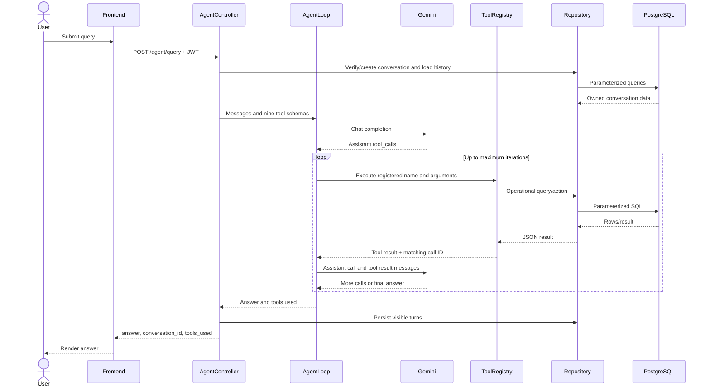

# AeroMind architecture

## Architectural goals

AeroMind favors visible separation of responsibilities, small testable agent components, provider isolation, safe registered tools, persistent user-owned memory, and deterministic simulated data. It deliberately avoids a large framework or live airport dependency for an academic demonstration.

## Backend layers

### Application entry point

`backend/main.cpp` reads database/server configuration, initializes the connection pool, configures the Drogon worker threads and restricted development CORS origin, then starts the HTTP server. Blocking provider calls are isolated from a single-thread event loop by using multiple Drogon workers.

### Controllers

`backend/controllers` declares all 17 routes. Controllers parse requests, enforce route-level validation and business status codes, call repositories or the agent layer, and serialize public JSON. `JwtAuthFilter` is attached declaratively to protected routes.

### Agent layer

- `LLMConfig` reads provider-neutral runtime configuration for the active Gemini provider.
- `LLMClient` serializes OpenAI-compatible requests and handles TLS HTTP, bounded responses, retries, and sanitized errors.
- `AgentLoop` coordinates assistant tool calls, matching tool result IDs, multiple calls, and bounded iterations.
- `ToolRegistry` is the only name-to-function dispatch boundary and publishes the nine JSON schemas.

There is no separate `AgentService` class in this repository; `AgentController` composes these focused components.

### Tool implementations

`backend/tools` validates agent-facing action arguments and delegates to repositories. Read tools expose operational queries. Write tools can create or resolve incidents; there is no shell or arbitrary SQL tool.

### Repositories

`backend/repositories` owns parameterized SQL and converts libpqxx rows into JSON structures used by controllers and tools. Conversation message reads join through `conversations.user_id`, providing defense-in-depth ownership enforcement.

### Database manager

`DatabaseManager` is a process-wide singleton connection pool. Initialization is synchronized, callers borrow shared connections, and repository transactions manage commits and rollback through RAII.

### Security

- `PasswordHasher` creates unique bcrypt salts and verifies password hashes.
- `JwtService` creates 24-hour HS256 tokens from an environment-only secret and verifies issuer, signature, and expiration.
- `JwtAuthFilter` rejects requests without a valid `Bearer` token.

### Models

The codebase does not define a separate model/DTO directory. PostgreSQL rows are mapped directly to JsonCpp values in repository helpers. This keeps the project compact but provides less compile-time domain modeling than typed DTOs.

## Frontend architecture

The React/JavaScript application uses React Router for public and protected pages. `ProtectedRoute` checks local token presence; the login page verifies existing sessions against `/auth/me`. `services/api.js` owns the `/api` Axios base URL and injects the bearer token. `authService.js` wraps login and registration.

`OverviewPage` loads flight, gate, runway, weather, and incident resources independently so one failure does not erase all dashboard state. `ChatPage` manages query submission, selected conversation persistence in session storage, conversation history loading, provider-friendly errors, and reusable sidebar/message/input/suggestion components.

## Request flows

### Standard REST request

1. Drogon matches a controller route.
2. The controller validates path/body data.
3. A repository executes parameterized SQL through the pool.
4. The controller returns compatible JSON and an appropriate HTTP status.

### Authenticated request

1. `JwtAuthFilter` parses `Authorization: Bearer <token>`.
2. `JwtService` verifies signature, issuer, and expiration.
3. The controller extracts `user_id` where an ownership decision is required.
4. The operation proceeds or returns `401`/`403`.

### Agent and tool sequence

### Conversation continuation

The optional `conversation_id` can be numeric JSON or a decimal string. The controller rejects non-owned conversations before loading context. Only stored user and assistant messages are replayed; tool messages require matching assistant call objects from the same provider turn and therefore remain ephemeral.

## Error propagation

- Validation errors stop in controllers with `400`.
- Authentication and ownership failures return `401` and `403`.
- Missing records return `404`; business conflicts return `409`.
- Repository exceptions are logged server-side and become sanitized `500` responses.
- Provider transport/status/JSON failures become controlled categories in `LLMClient`, then a generic `502` at `/agent/query`.
- Tool validation problems become JSON tool results so Gemini can explain or recover without terminating the entire request.

Logs intentionally omit credentials, authorization headers, full prompt history, passwords, and provider bodies.

## Dependency boundaries

The frontend depends only on AeroMind HTTP contracts. Gemini is behind `LLMClient`; tools depend on repositories; repositories depend on PostgreSQL. Automated agent tests replace HTTP transport and tool execution with fakes, so they remain deterministic and offline.

## Design decisions

- **Drogon:** native C++ HTTP routing, JSON responses, filters, and asynchronous server infrastructure.
- **PostgreSQL/libpqxx:** relational constraints and parameterized queries for operational data and memory.
- **Registered tools:** a narrow allowlist prevents arbitrary code or SQL execution.
- **Simulated data:** predictable demonstrations without paid, unstable, or unavailable airport feeds.
- **Bounded loop:** prevents unlimited provider/tool execution.
- **Mocked Gemini tests:** protects secrets, quota, speed, and repeatability.
- **OpenAI-compatible Gemini endpoint:** preserves the existing message/tool format without a new SDK.

## Trade-offs

Provider requests and repository calls are synchronous, so throughput is limited by the worker pool. JSON row mappings reduce type boilerplate but provide weaker compile-time domain guarantees. Public read endpoints are intentionally open for demonstration, while write and conversation endpoints require a JWT; roles are stored but role-specific authorization is not yet enforced.
