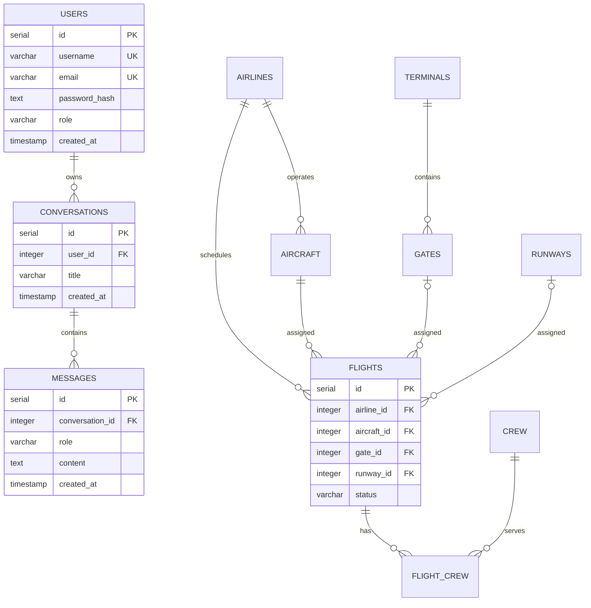

# AeroMind database

## Transactional gate assignment

Flights reach terminals through `flights.gate_id -> gates.terminal_id`. Gate
state is `AVAILABLE`, `OCCUPIED`, `MAINTENANCE`, or `CLOSED`. Assignment uses
`SELECT ... FOR UPDATE` in one transaction so two requests cannot claim the
same available gate; the previous gate release, target occupation, and flight
foreign-key change commit atomically.

## Purpose and initialization

PostgreSQL stores simulated airport operations, users, and persistent agent conversations. On the first creation of the Compose volume, PostgreSQL runs `sql/init.sql` and then `sql/seed.sql`. These scripts use `CREATE TABLE IF NOT EXISTS`, but seed inserts are intended for a new empty volume rather than repeated manual execution. Existing volumes are not destroyed during normal startup.

The development database defaults to `aeromind`. The automated C++ suite currently uses fakes and unit-level components; it does not create or reset a separate test database.

## Entity relationships

## Table inventory

### `users`

| Column | Type | Nullable/default | Constraint and purpose |
| --- | --- | --- | --- |
| `id` | SERIAL | No | Primary key |
| `username` | VARCHAR(80) | No | Unique login/display name |
| `email` | VARCHAR(160) | No | Unique normalized login email |
| `password_hash` | TEXT | No | bcrypt hash; never plaintext |
| `role` | VARCHAR(40) | No, `operator` | Stored role label |
| `created_at` | TIMESTAMP | No, current time | Creation timestamp |

Deleting a user cascades to conversations and their messages.

### `airlines`

| Column | Type | Nullable/default | Constraint and purpose |
| --- | --- | --- | --- |
| `id` | SERIAL | No | Primary key |
| `name` | VARCHAR(120) | No | Airline name |
| `iata_code` | VARCHAR(3) | No | Unique IATA code |
| `icao_code` | VARCHAR(4) | No | Unique ICAO code |
| `country` | VARCHAR(80) | Yes | Home country |
| `created_at` | TIMESTAMP | No, current time | Creation timestamp |

Airline deletion is restricted while aircraft or flights reference it.

### `aircraft`

| Column | Type | Nullable/default | Constraint and purpose |
| --- | --- | --- | --- |
| `id` | SERIAL | No | Primary key |
| `registration_number` | VARCHAR(20) | No | Unique registration |
| `aircraft_type` | VARCHAR(120) | No | Model/type |
| `airline_id` | INTEGER | No | FK to `airlines`, delete restricted |
| `status` | VARCHAR(40) | No, `ACTIVE` | `ACTIVE`, `MAINTENANCE`, or `RETIRED` |
| `created_at` | TIMESTAMP | No, current time | Creation timestamp |

### `terminals`

| Column | Type | Nullable/default | Constraint and purpose |
| --- | --- | --- | --- |
| `id` | SERIAL | No | Primary key |
| `name` | VARCHAR(80) | No | Unique terminal name |
| `code` | VARCHAR(8) | No | Unique short code |
| `capacity` | INTEGER | No | Must be greater than zero |
| `created_at` | TIMESTAMP | No, current time | Creation timestamp |

### `gates`

| Column | Type | Nullable/default | Constraint and purpose |
| --- | --- | --- | --- |
| `id` | SERIAL | No | Primary key |
| `gate_number` | VARCHAR(10) | No | Gate label |
| `terminal_id` | INTEGER | No | FK to `terminals`, delete restricted |
| `status` | VARCHAR(40) | No, `AVAILABLE` | `AVAILABLE`, `OCCUPIED`, `MAINTENANCE`, or `CLOSED` |
| `created_at` | TIMESTAMP | No, current time | Creation timestamp |

`gate_number` and `terminal_id` are unique together. Flight gate references become null when a gate is deleted.

Gate availability is represented solely by `status = 'AVAILABLE'`; there is no boolean availability column. `OCCUPIED` is counted separately from non-operational `MAINTENANCE` and `CLOSED` states. Flights reach a terminal through `flights.gate_id -> gates.terminal_id`; there is no direct `flights.terminal_id` column.

### `runways`

| Column | Type | Nullable/default | Constraint and purpose |
| --- | --- | --- | --- |
| `id` | SERIAL | No | Primary key |
| `runway_code` | VARCHAR(10) | No | Unique runway designation |
| `status` | VARCHAR(40) | No, `OPERATIONAL` | `OPERATIONAL`, `MAINTENANCE`, or `CLOSED` |
| `length_meters` | INTEGER | No | Must be greater than zero |
| `surface` | VARCHAR(40) | No, `ASPHALT` | Surface material |
| `created_at` | TIMESTAMP | No, current time | Creation timestamp |

Flight runway references become null when a runway is deleted.

### `flights`

| Column | Type | Nullable/default | Constraint and purpose |
| --- | --- | --- | --- |
| `id` | SERIAL | No | Primary key |
| `flight_number` | VARCHAR(20) | No | Operational flight number |
| `airline_id` | INTEGER | No | FK to airline, delete restricted |
| `aircraft_id` | INTEGER | No | FK to aircraft, delete restricted |
| `gate_id` | INTEGER | Yes | FK to gate, set null on deletion |
| `runway_id` | INTEGER | Yes | FK to runway, set null on deletion |
| `origin` / `destination` | VARCHAR(3) | No | Three uppercase letters |
| `departure_time` / `arrival_time` | TIMESTAMP | No | Arrival must follow departure |
| `status` | VARCHAR(40) | No, `SCHEDULED` | `SCHEDULED`, `BOARDING`, `IN_FLIGHT`, `DELAYED`, `CANCELLED`, or `LANDED` |
| `created_at` | TIMESTAMP | No, current time | Creation timestamp |

### `crew`

| Column | Type | Nullable/default | Constraint and purpose |
| --- | --- | --- | --- |
| `id` | SERIAL | No | Primary key |
| `full_name` | VARCHAR(150) | No | Crew member name |
| `role` | VARCHAR(60) | No | Operational role |
| `employee_code` | VARCHAR(24) | No | Unique employee code |
| `availability_status` | VARCHAR(40) | No, `AVAILABLE` | `AVAILABLE`, `ON_DUTY`, `RESTING`, or `UNAVAILABLE` |
| `created_at` | TIMESTAMP | No, current time | Creation timestamp |

### `flight_crew`

| Column | Type | Nullable/default | Constraint and purpose |
| --- | --- | --- | --- |
| `flight_id` | INTEGER | No | FK to flight, cascades on flight deletion |
| `crew_id` | INTEGER | No | FK to crew, delete restricted |
| `assigned_role` | VARCHAR(60) | No | Role on this flight |
| `created_at` | TIMESTAMP | No, current time | Assignment timestamp |

The composite primary key is (`flight_id`, `crew_id`).

### `weather_reports`

| Column | Type | Nullable/default | Constraint and purpose |
| --- | --- | --- | --- |
| `id` | SERIAL | No | Primary key |
| `condition` | VARCHAR(100) | No | Weather summary |
| `visibility_km` | NUMERIC(5,2) | No | Non-negative visibility |
| `wind_speed_kmh` | NUMERIC(6,2) | No | Non-negative speed |
| `wind_direction` | VARCHAR(3) | No, `VRB` | Direction abbreviation |
| `temperature_c` | NUMERIC(5,2) | No | Temperature |
| `pressure_hpa` | NUMERIC(7,2) | No, `1013.25` | Pressure |
| `created_at` | TIMESTAMP | No, current time | Observation timestamp |

### `incidents`

| Column | Type | Nullable/default | Constraint and purpose |
| --- | --- | --- | --- |
| `id` | SERIAL | No | Primary key |
| `title` | VARCHAR(200) | No | Short title |
| `description` | TEXT | No | Operational detail |
| `severity` | VARCHAR(40) | No | `LOW`, `MEDIUM`, `HIGH`, or `CRITICAL` |
| `location` | VARCHAR(150) | Yes | Airport location |
| `status` | VARCHAR(40) | No, `OPEN` | `OPEN`, `INVESTIGATING`, or `RESOLVED` |
| `created_at` | TIMESTAMP | No, current time | Creation timestamp |
| `resolved_at` | TIMESTAMP | Yes | Resolution timestamp |

### `conversations`

| Column | Type | Nullable/default | Constraint and purpose |
| --- | --- | --- | --- |
| `id` | SERIAL | No | Primary key |
| `user_id` | INTEGER | No | FK to `users`, delete cascade |
| `title` | VARCHAR(200) | No, default title | Conversation label |
| `created_at` | TIMESTAMP | No, current time | Creation timestamp |

### `messages`

| Column | Type | Nullable/default | Constraint and purpose |
| --- | --- | --- | --- |
| `id` | SERIAL | No | Primary key |
| `conversation_id` | INTEGER | No | FK to conversation, delete cascade |
| `role` | VARCHAR(40) | No | `user`, `assistant`, `system`, or `tool` |
| `content` | TEXT | No | Serialized visible message content |
| `provider_payload` | JSONB | Yes | Validated replay-compatible provider message |
| `tool_calls` | JSONB | Yes | Normalized assistant tool calls |
| `tool_results` | JSONB | Yes | Normalized tool result |
| `presentation` | JSONB | Yes | Reserved Phase 8-compatible storage; not generated in Phase 7 |
| `metadata` | JSONB | Yes | Safe schema, tool, ordering, and status metadata |
| `turn_id` | VARCHAR(64) | Yes | Server-generated logical turn group |
| `turn_status` | VARCHAR(20) | Yes | `in_progress`, `completed`, or `failed` |
| `created_at` | TIMESTAMP | No, current time | Message timestamp |

Fresh databases receive these fields from `init.sql`. Existing databases use `sql/upgrades/phase7_rich_conversation_memory.sql`; it is idempotent, does not drop data, and may be applied twice safely. Legacy null structured fields remain readable.

## Indexes

- `idx_users_email` on `users(email)` (in addition to the unique index)
- `idx_aircraft_airline` on `aircraft(airline_id)`
- `idx_gates_terminal_status` on `gates(terminal_id, status)`
- `idx_flights_airline`, `idx_flights_aircraft`, and `idx_flights_gate`
- `idx_flights_status_departure` on `(status, departure_time)` for delayed/status queries
- `idx_flight_crew_crew` on `flight_crew(crew_id)`
- `idx_weather_created` descending on weather timestamps
- `idx_incidents_status_created` on status and descending creation time
- `idx_messages_conversation_created` for chronological history reads
- `idx_messages_conversation_turn` for complete-turn grouping

PostgreSQL automatically supplies indexes for primary and unique constraints. Phase 7 includes a targeted manual upgrade script, not a general migration framework.

The existing `(terminal_id, status)` gate index and `flights(gate_id)` index cover terminal aggregates and flight joins. Terminal name/code unique constraints already provide indexes, so Phase 3 adds no duplicates.

## Seed data

`seed.sql` provides two demo users with bcrypt hashes, five airlines, 25 aircraft, three terminals, 36 gates, three runways, 150 schedule-relative flights, 20 crew, assignments for 40 flights, 30 weather reports, 30 incidents, and two example conversations. Flight times are anchored to initialization time and status is derived from schedule rules. This keeps delayed, boarding, scheduled, cancelled, in-flight, and landed scenarios useful when a fresh database is created.

The data is realistic simulation, not a live operational feed. Predictability avoids third-party availability, quota, cost, and safety concerns.
